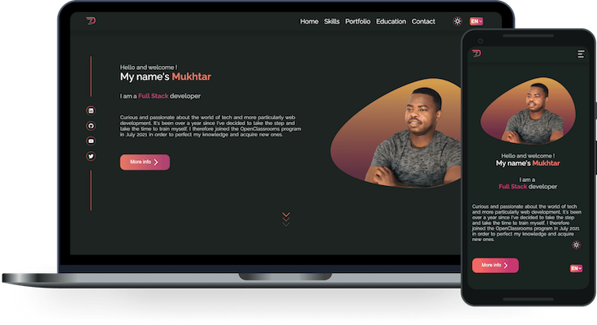

# Nuxt Developer Portfolio #

This project is the old version of my current portfolio. Feel free to use it of you want!

The project was built using Nuxt 3 and SASS.

## Installation ##

Clone the project into your local machine and then run :

1 - `yarn install` will install all the dependencies and devDependencies needed for the project.
2-  Create the Google Oauth2 protocole so that you can receive mails with nodemailer.
3- Once you've created your Google Oauth2, create an .env file in the root of the project and create the following environment variables:

  `CLIENT_ID = <your-oauth2-client-id>` 
  `CLIENT_SECRET = <your-oauth2-client-secret>` 
  `REDIRECT_URL = <your-oauth2-redirect-url>` 
  `REFRESH_TOKEN = <your-oauth2-refresh-token>` 
  `RECEIVER_USER = <reciever-email>` 
   `SENDER_USER = <sender-email>`

## Usage ##

You can then run `yarn dev`. The app should run on localhost with the default port `3000`.
